# 多层感知器
MLP: Multilayer Perceptron

## 从非连续边界说起
现实生活中，有很多数据的边界并不是连续的，数据分布比较离散，数据的边界就是非连续的。

非连续边界数据是指在一定范围内不连续的数据点，举几个例子：

- 一个国家的人口分布数据，每个城市的人口数量是一个离散的数据点，城市之间存在空隙，属于非连续边界数据。
- 一个城市的交通拥堵指数数据，每个时段的指数是一个离散的数据点，不同时间段之间存在间隔，属于非连续边界数据。

以下就是一个非连续边界的数据分布 ⬇️
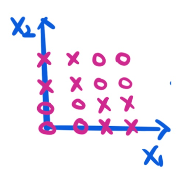
可以看到上图中的数据，不能用一条直线或者一条连续的曲线去进行拟合，只能用非连续的边界曲线去拟合。

为了搞清楚MLP原理，我们把数据简化一下可以得到下图 ⬇️
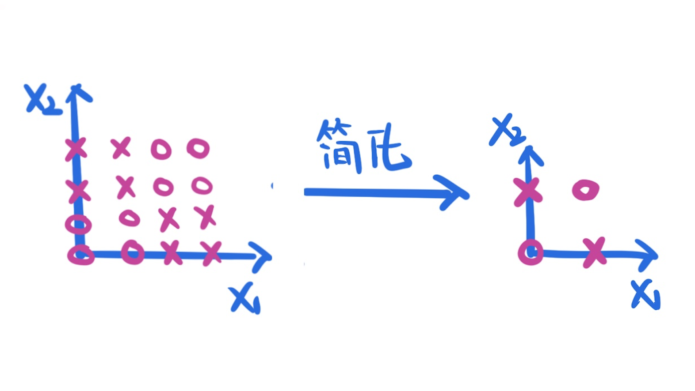
用一个表格表示一下上图的值，可以看出这是一个**同或门**。**我们知道，同或门可以看成基础的与或非门等的组合。**

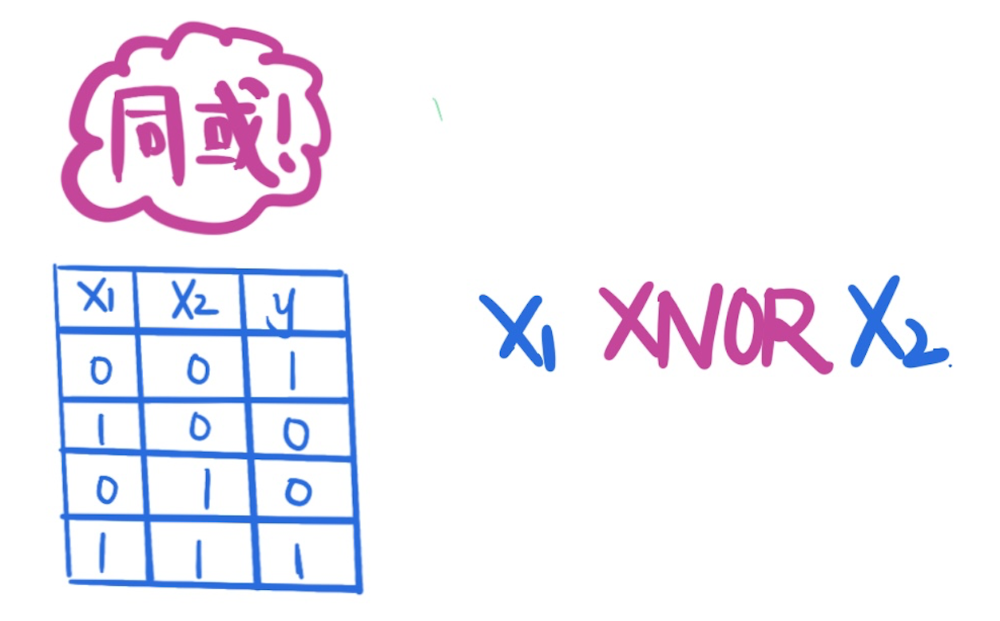

先来看看或门（OR）：

我们可以用一个sigmoid函数去拟合数据：
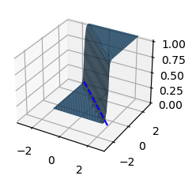

在这里我们选择一条简单的直线作为数据边界函数，可以得到：

当然你也可以用其他的边界函数，因为这里的数据比较少，合适的边界函数有很多。

接下来看看与门（AND）：

同样，我们可以用一个sigmoid函数去拟合数据：

在这里我们同样选择一条简单的直线作为数据边界函数，可以得到：
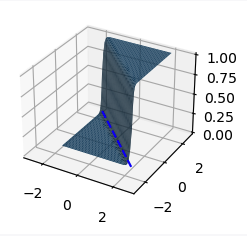

最后看看与非门（NAND）：
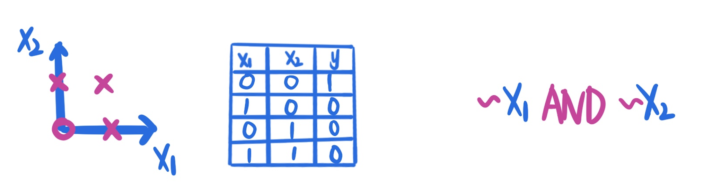

我们用一个sigmoid函数去拟合数据
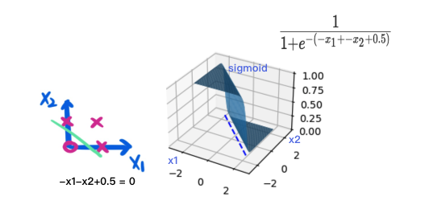

在这里我们同样选择一条简单的直线作为数据边界函数，可以得到：
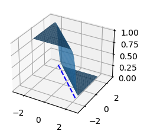

最后，同或门其实就是上面或门、非门、与非门的组合：
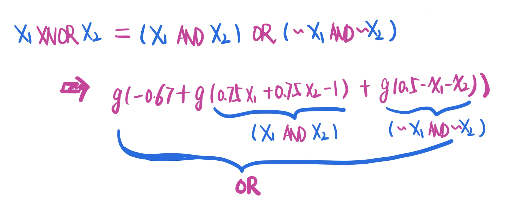
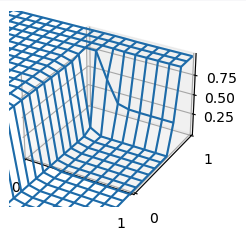
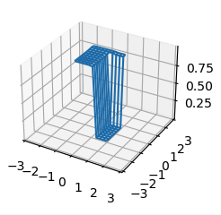

简单画一下图就是：
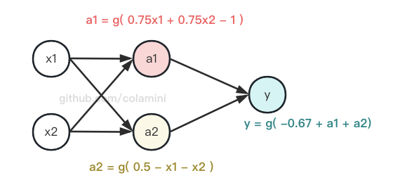

把多层感知器（Multilayer Perceptron，简称MLP）抽象一下如下：
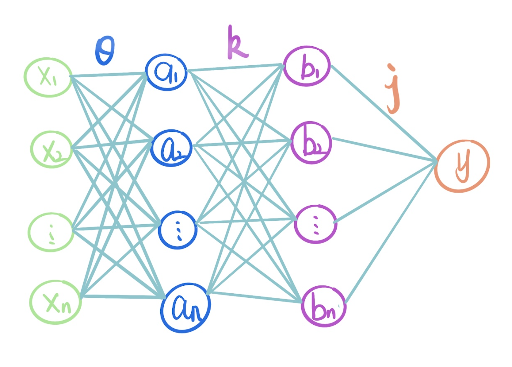

多层感知器（Multilayer Perceptron，简称MLP）是一种人工神经网络模型，也是最常用的神经网络模型之一。它由一个或多个神经网络层组成，每一层由多个神经元（neuron）组成，每个神经元都与下一层的所有神经元相连。MLP可以用于分类、回归和预测等任务。

MLP可以处理高维度、非线性和复杂的数据，如图像、音频和文本等。它具有良好的泛化能力，可以在训练集之外的数据上获得很好的性能。MLP也可以使用反向传播算法来进行训练，即通过计算误差梯度来更新模型参数，使模型可以适应不同的数据集和任务。

输入计算过程：

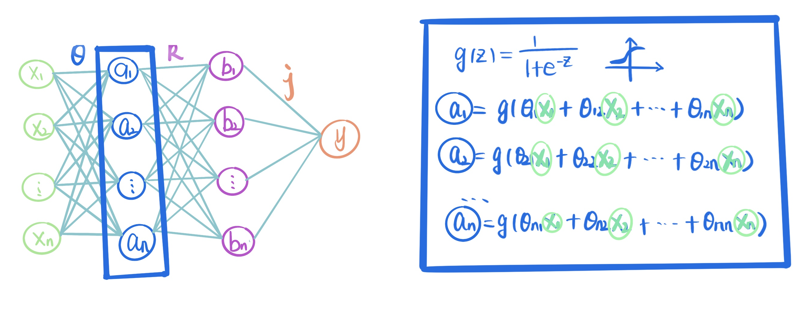

第二层计算过程
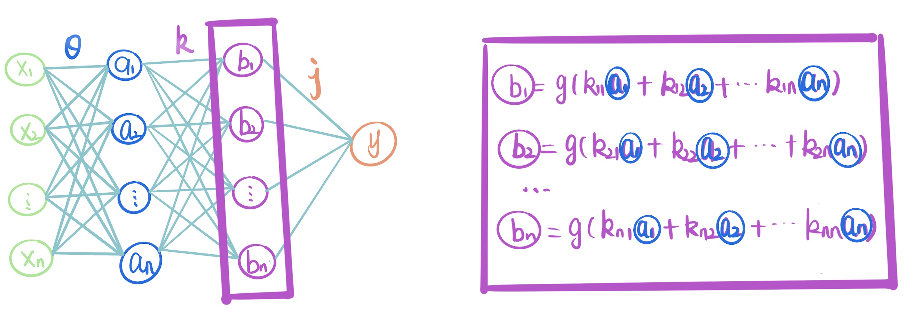

输出计算过程
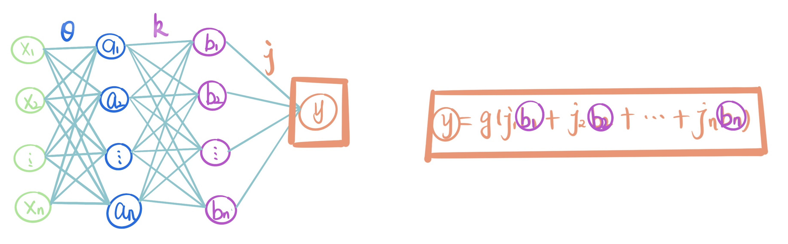

