# RNN
# 什么是RNN
我们知道，**RNN（循环神经网络）** 是一种用于处理`序列数据`的神经网络。

在每个基础单元中，`RNN`接收输入 $X_t$ 和先前隐藏状态 $h_t$，计算输出和更新后的隐藏状态$h_{t-1}$，也即是下图中的$h_0$、$h_1$、...、$h_4$, 并传递给下一个时间步。

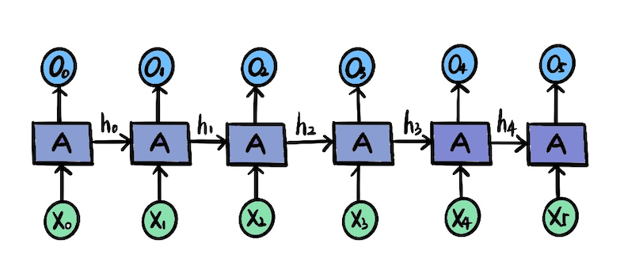

那么基础单元里面到底是怎么计算的呢？我们把 `RNN` 模型的基础单元展开来看。有两个计算的公式：

1、隐藏状态 $h_t$

> $h_t = tanh(W_{xh}X_t + W_{hh}h_{t-1})$

其中，tanh是激活函数，$h_t$ 是关于上一个记忆隐藏状态 $h_{t-1}$ 和 本次输入 $X_t$ 的函数。

2、输出 $O_t$
> $O_t = W_{oh}h_t + b_o$

## RNN的输入输出关系

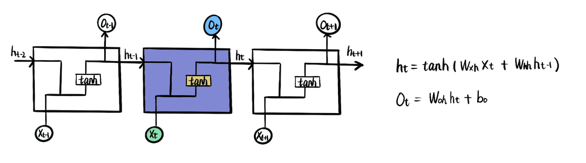

## LSTM
LSTM是什么
跟rnn的关系
由什么组成

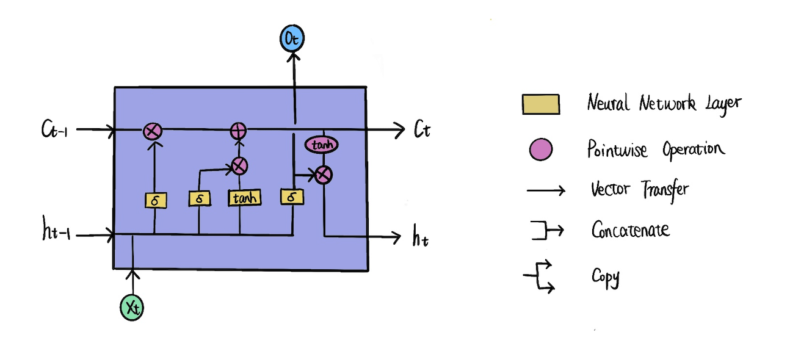
遗忘门
怎么计算
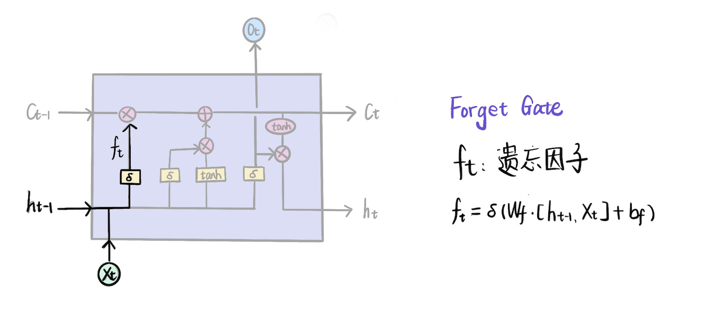
输入门组成
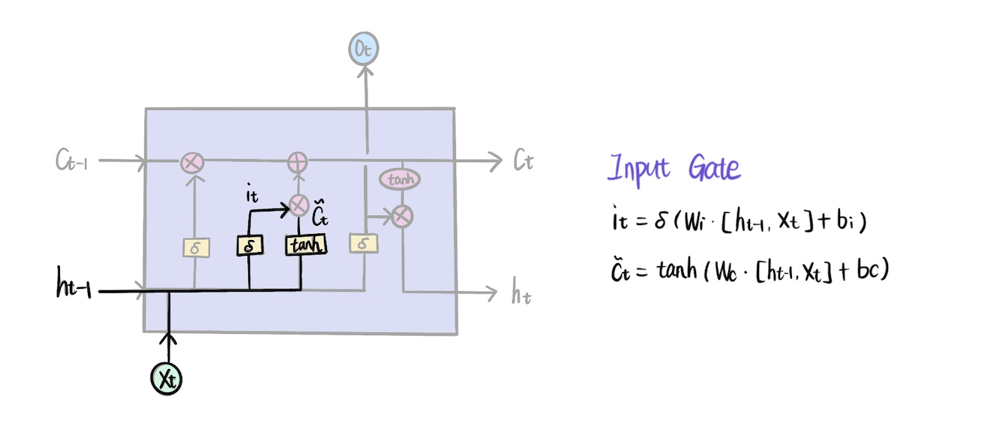

Ct是长期记忆线，作为一个新的变量保存需要长期记忆的信息
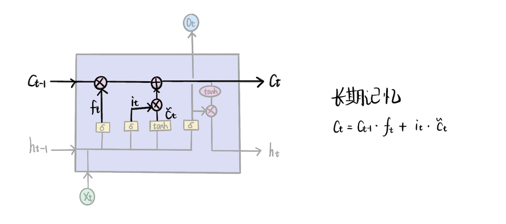

输出门
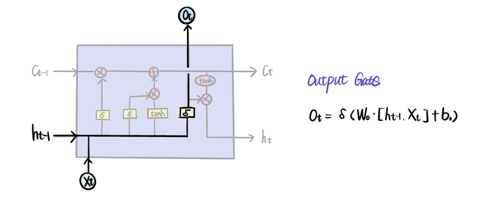

最终输出
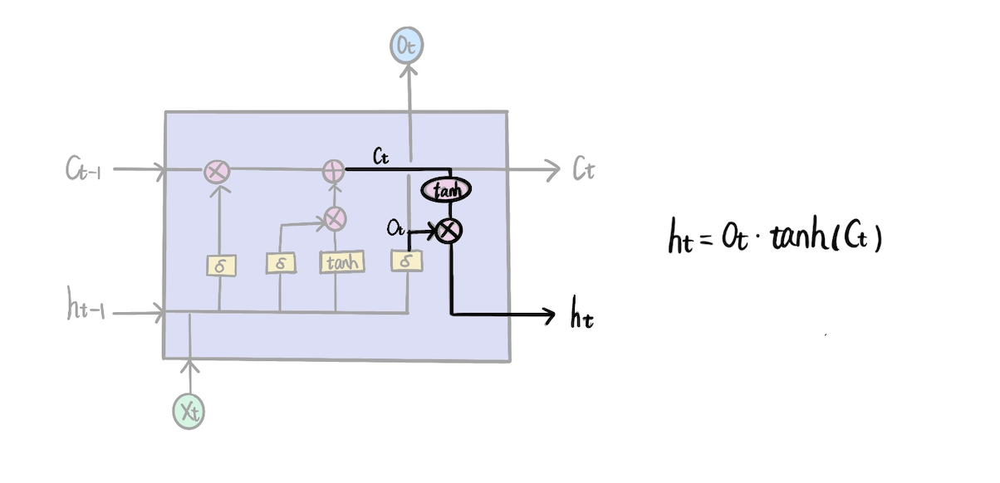

## GRU
GRU与LSTM比较有什么区别

重置门和更新门
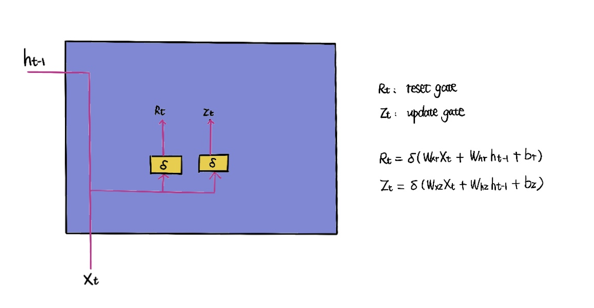
预测状态

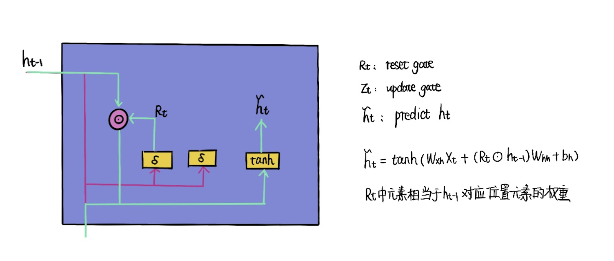

输出
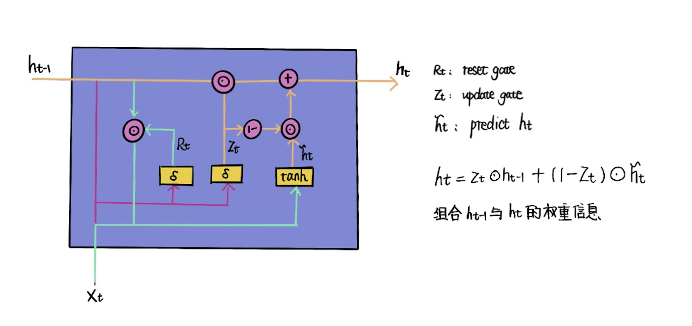