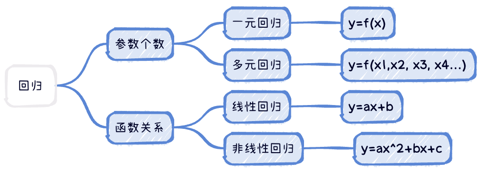

# 回归基本介绍

> 回归：根据输入数据，找到 **两种或两种以上变量** 之间相互依赖的定量关系。
比如：
- 房价随时间变化的关系（两个变量：**房价、时间**，一个关系）
- 房价与面积之间的关系（两个变量：**房价、面积**，一个关系）

## 回归问题的分类
回归问题的分类一般有以下几种 ⬇️

1. 根据参数的个数多少，可以把回归问题分为：
- **一元回归**，即 `y = f(x)`
- **多元回归**，即 `y = f(x1, x2, x3, ...)`

2. 根据变量与变量之间的关系，可以把回归问题分为：
- **线性回归**，即 `y = ax + b`
- **非线性回归**，即 `y = ax^2 + bx + c`
